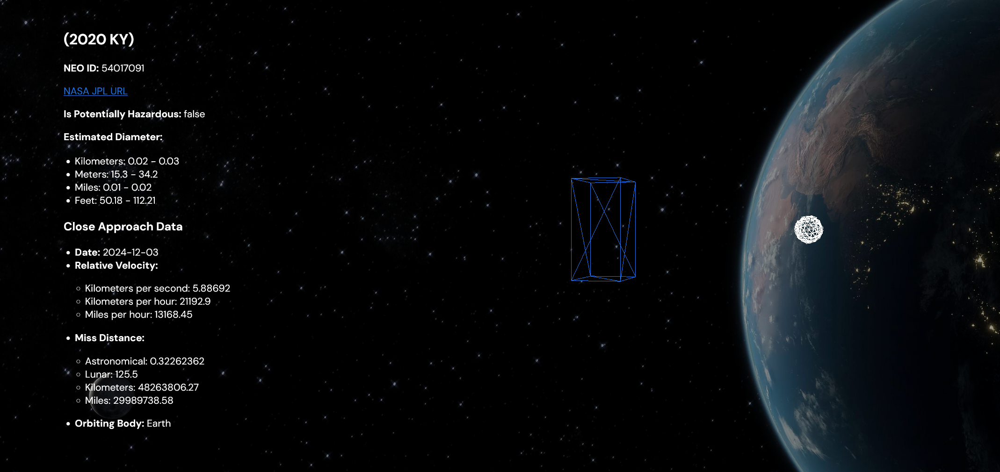

# NEO Data Pipeline and Visualization Project

## Overview

This project is designed to fetch, process, and visualize today's close approach Near-Earth Object (NEO) data. A NEO's close approach date indicates the day it will be the closest to the Earth in its orbit. The primary focus is on leveraging AWS cloud services to build a scalable and efficient data pipeline. The project also includes a frontend component for visualizing objects compared to the statue of liberty.

You can view the project here: [NEO Data Visualization](https://aws-pipeline.vercel.app/) **(Best experienced on Firefox-based browsers)**.

## Architecture

### 1. Data Pipeline

#### AWS Lambda
- **Data Ingestion**: A serverless compute service that triggers daily to fetch NEO data from an external API (NASA's NeoWs).
- **Data Querying**: Another Lambda function acts as an API endpoint, querying the DynamoDB database for processed NEO data. This function is integrated with API Gateway, allowing the frontend to fetch the latest NEO data dynamically.
- **Integration**: The Lambda functions are scheduled using AWS CloudWatch Events, ensuring regular data ingestion and providing a responsive API for querying the database.

#### AWS S3
- **Usage**: S3 buckets store raw NEO data fetched by the Lambda function. This ensures that the data is securely stored and easily accessible for further processing.
- **Optimization**: The data is stored in a cost-effective manner, with lifecycle policies set to transition older data to cheaper storage classes or delete them after a specific period.

#### AWS DynamoDB
- **Role**: Serves as the primary database for storing processed NEO data. DynamoDB is chosen for its scalability, flexibility, and integration with other AWS services.
- **Data Structuring**: Data is organized to optimize query performance, ensuring that the frontend can retrieve the necessary information quickly.

#### AWS CloudWatch
- **Monitoring**: CloudWatch is used to monitor the entire pipeline, providing insights into performance metrics, error rates, and operational health.
- **Logging**: Logs from Lambda and other services are collected in CloudWatch Logs for troubleshooting and analysis.

### 2. Frontend

#### Technologies Used
- **Three.js**: A JavaScript library used to render 3D visualizations of the NEO data, providing users with an interactive way to explore the information.
- **HTML/CSS**: The frontend is structured using standard web technologies, with CSS handling the visual design and layout.
- **JavaScript**: Facilitates the integration between the frontend components and the data stored in AWS, ensuring that the latest NEO data is always displayed.

### 3. Deployment

#### Vercel
- **Hosting**: The frontend is deployed on Vercel, providing a fast and reliable platform for serving the web application. Vercel's integration with GitHub ensures continuous deployment whenever changes are made.

## Features

- **Automated Data Fetching**: The pipeline is fully automated, ensuring up-to-date NEO data without manual intervention.
- **Scalable and Serverless**: The use of AWS Lambda and DynamoDB ensures that the solution scales automatically with the workload, with no need for server management.
- **Cost-Effective Storage**: S3 lifecycle policies help manage costs by transitioning or deleting old data.
- **Real-Time Monitoring**: AWS CloudWatch provides comprehensive monitoring and logging, ensuring that the system is robust and issues can be identified and resolved quickly.
- **Interactive Visualization**: The frontend provides users with an interactive 3D visualization of NEO data, making it easy to explore the information.
- **Dynamic Data Querying**: The Lambda API allows the frontend to query the DynamoDB database in real-time, ensuring that users always see the most current data.

## Additional Notes

### Browser Recommendation
There are performance issues on Chromium-based browsers that I will try to address in the future. For now, **Firefox-based browsers** will provide the best experience.
