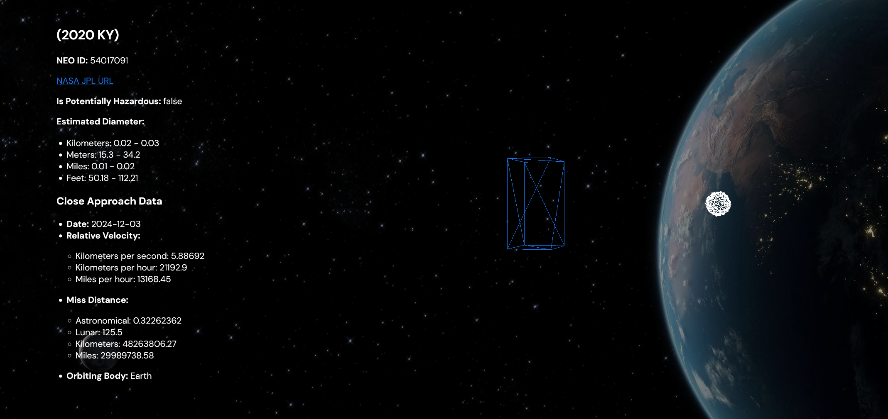

# NEO Data Pipeline and Visualization Project

## Overview

This project is designed to fetch, process, and visualize today's close approach Near-Earth Object (NEO) data. A NEO's close approach date indicates the day it will be the closest to the Earth in its orbit. The primary focus is on leveraging AWS cloud services to build a scalable and efficient data pipeline. The project also includes a frontend component for visualizing objects compared to the statue of liberty.

You can view the project here: [NEO Data Visualization](https://aws-pipeline.vercel.app/) **(Best experienced on Firefox-based browsers)**.

## Architecture

### 1. Data Pipeline

#### AWS Lambda
- **Data Ingestion**: A serverless compute service that triggers daily to fetch NEO data from an external API (NASA's NeoWs).
- **Data Querying**: Another Lambda function acts as an API endpoint, querying the DynamoDB database for processed NEO data. This function is integrated with API Gateway, allowing the frontend to fetch the latest NEO data dynamically.

#### AWS S3
- **Usage**: S3 buckets store raw NEO data fetched by the Lambda function. 
- **Lifecycle**: The data is stored in a cost-effective manner, with lifecycle policies set to transition older data to cheaper storage classes or delete them after a specific period.

#### AWS DynamoDB
- **Role**: Serves as the primary database for storing processed NEO data.

### 2. Frontend

#### Technologies Used
- **Three.js**: A JavaScript library used to render 3D visualizations of the NEO data, providing users with an interactive way to explore the information.

### 3. Deployment

#### Vercel
- **Hosting**: The frontend is deployed on Vercel, providing a fast and reliable platform for serving the web application. Vercel's integration with GitHub ensures continuous deployment whenever changes are made.

## Additional Notes

### Browser Recommendation
There are performance issues on Chromium-based browsers that I will try to address in the future. For now, **Firefox-based browsers** will provide the best experience.
